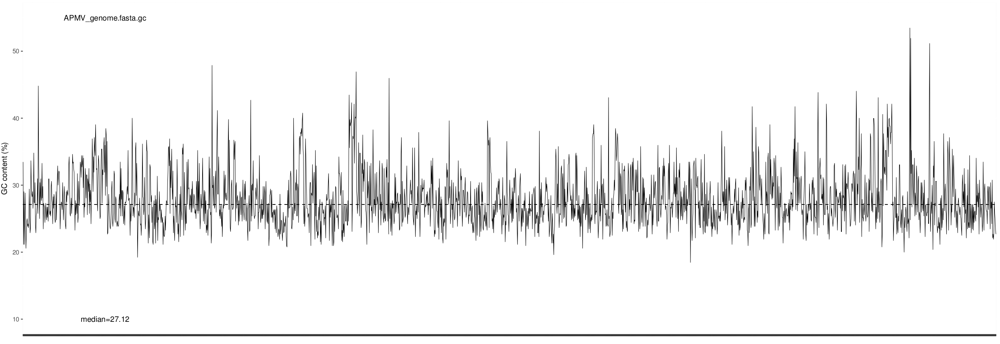
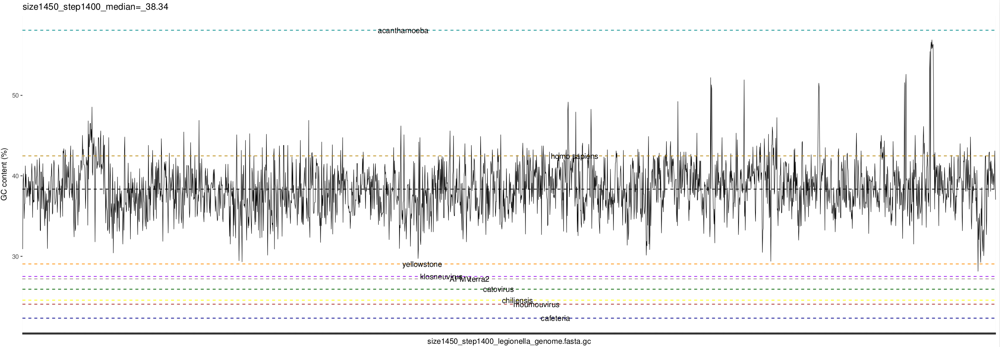

As a first idea, GC-content across the genome was tested for the different species to see if there are regions in the genome that show a GC-content that is more typical for a different species.

The R script GC\_counter.R is a sliding window approach that takes three arguments: The path to the genome file, the window size and the window step to advance. It produces a table of GC-percentages that can be plotted by GC_plotter.R

To loop over many window sizes and step sizes, GC\_loop_sizes.sh can be used to find good parameters.

The top plot shows the GC-content of APMV with a window size of 520nt and a step size of 500nt, as an example. Bottom: GC-content of Legionella with the medians of some other organisms/genomes that can indicate interesting regions.

Median of Legionella: 38.34%
Median of Mimivirus: 27.12%

