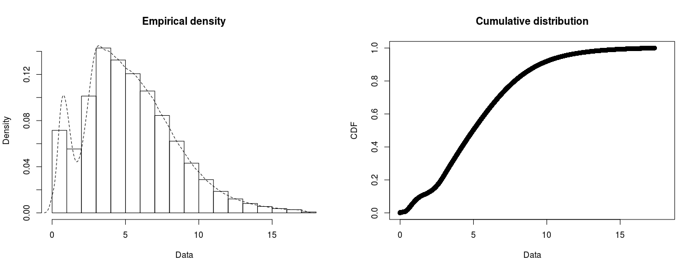
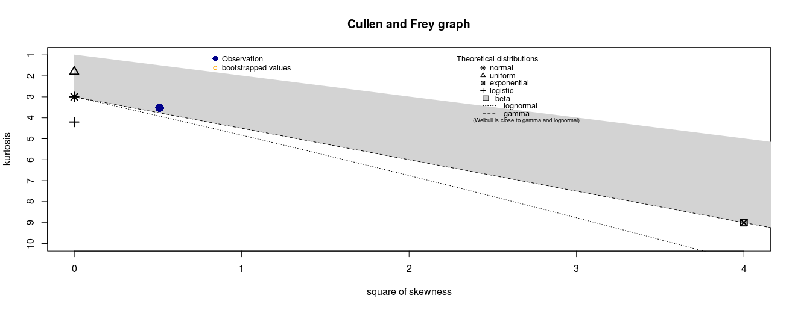
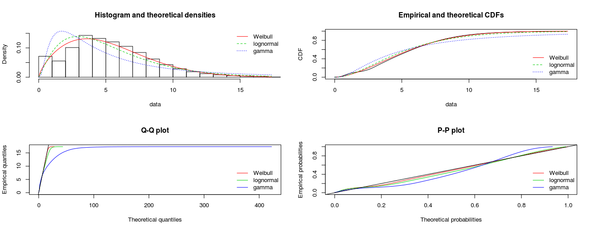
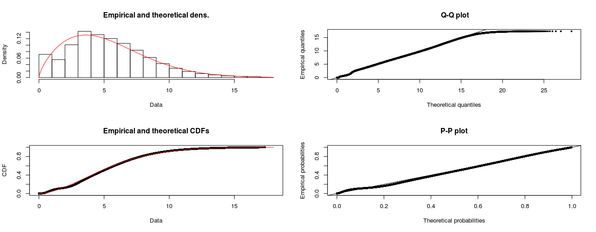
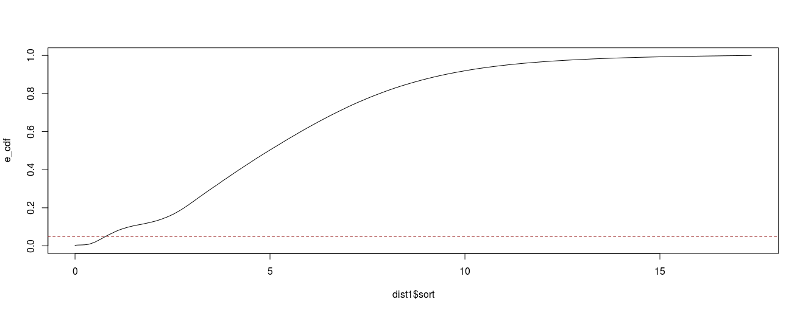

A distribution was fit to the distances of all orthologs between Legionella and any other species with the R package fitdistrplus. The skewness and kurtosis suggest using either a Weibull, lognormal or gamma distribution. Weibull shows the best fit specially for the tails of the distribution. This can be used to get a threshold for the e.g. 5% closest orthologs from any species with the dropdown menu below. The second drop-down menu can be used to select the legionella gene from the hits.

