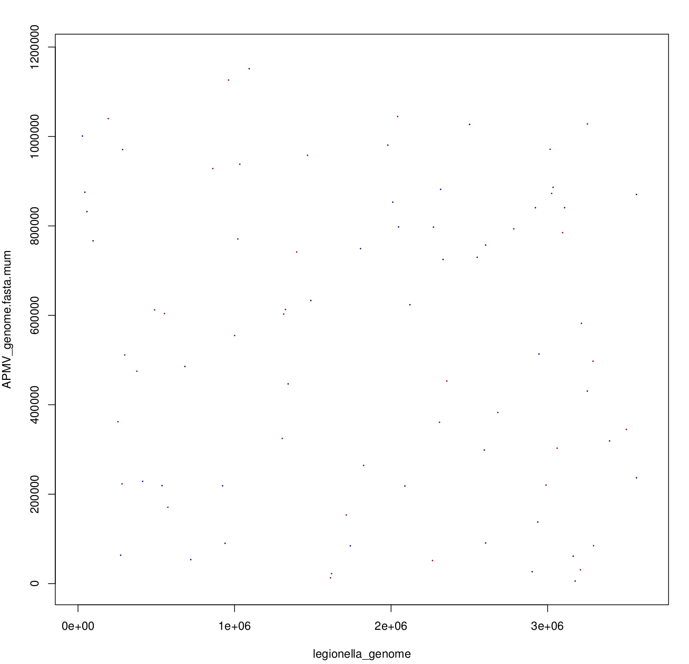
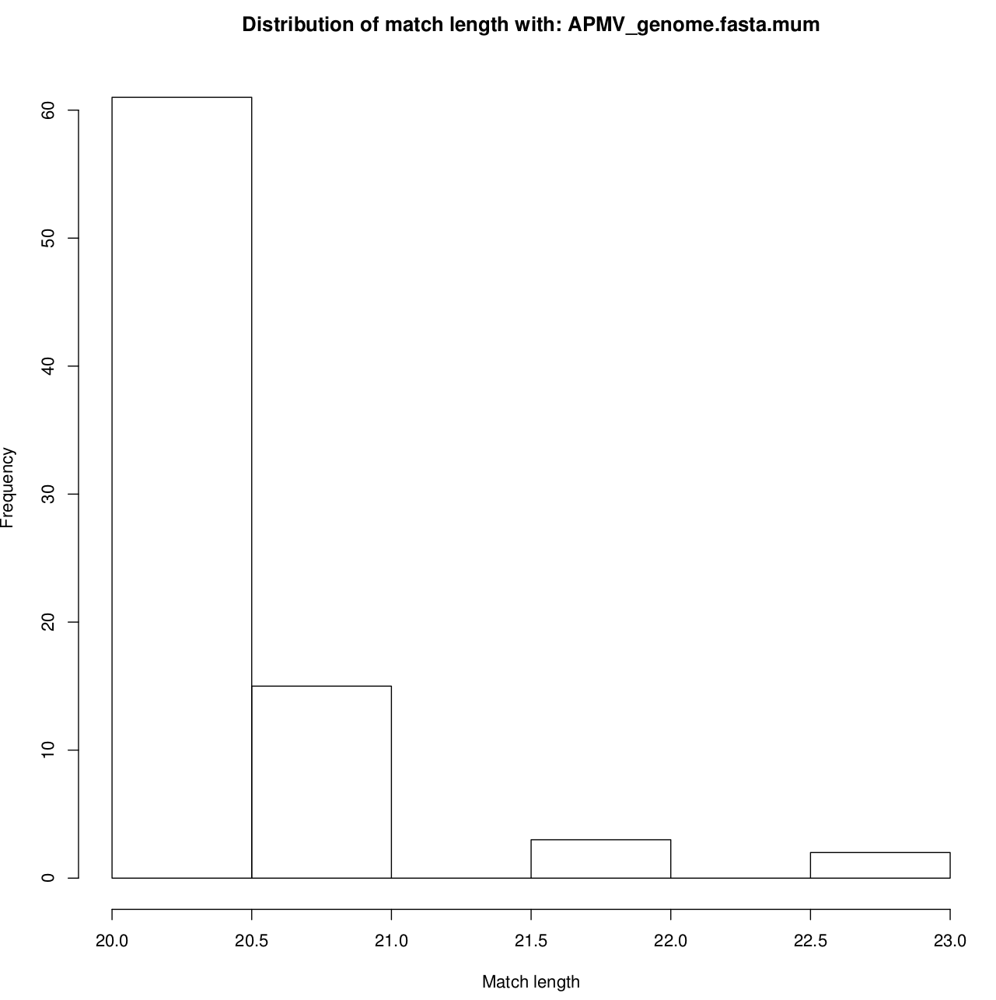
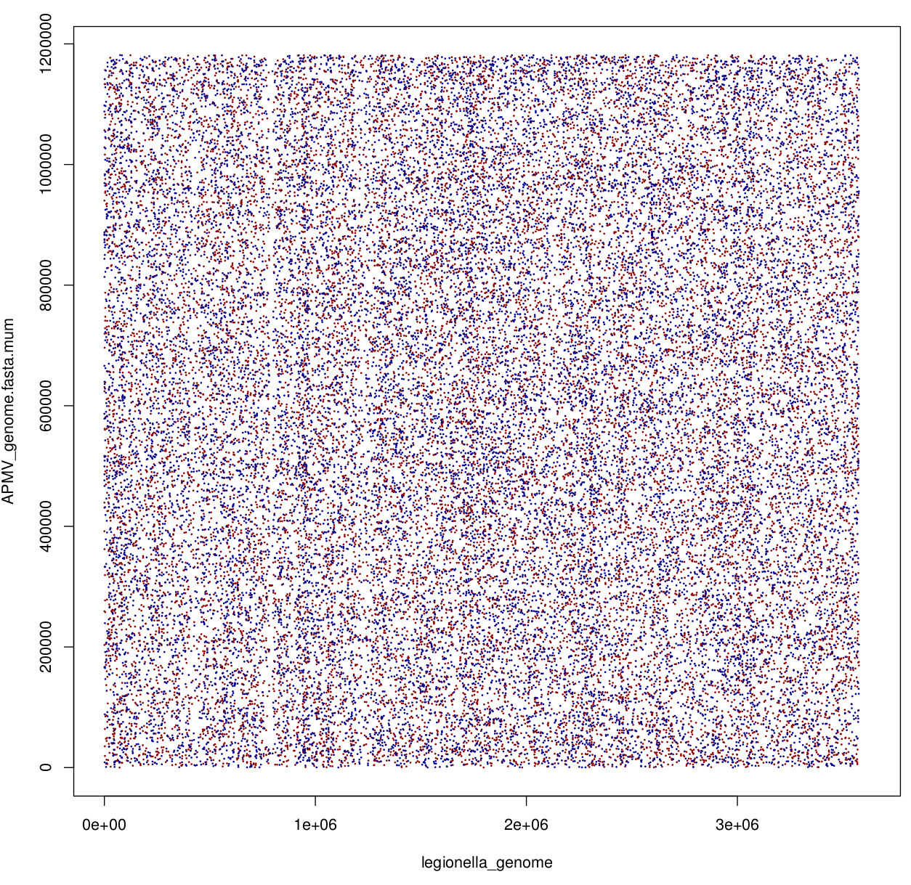
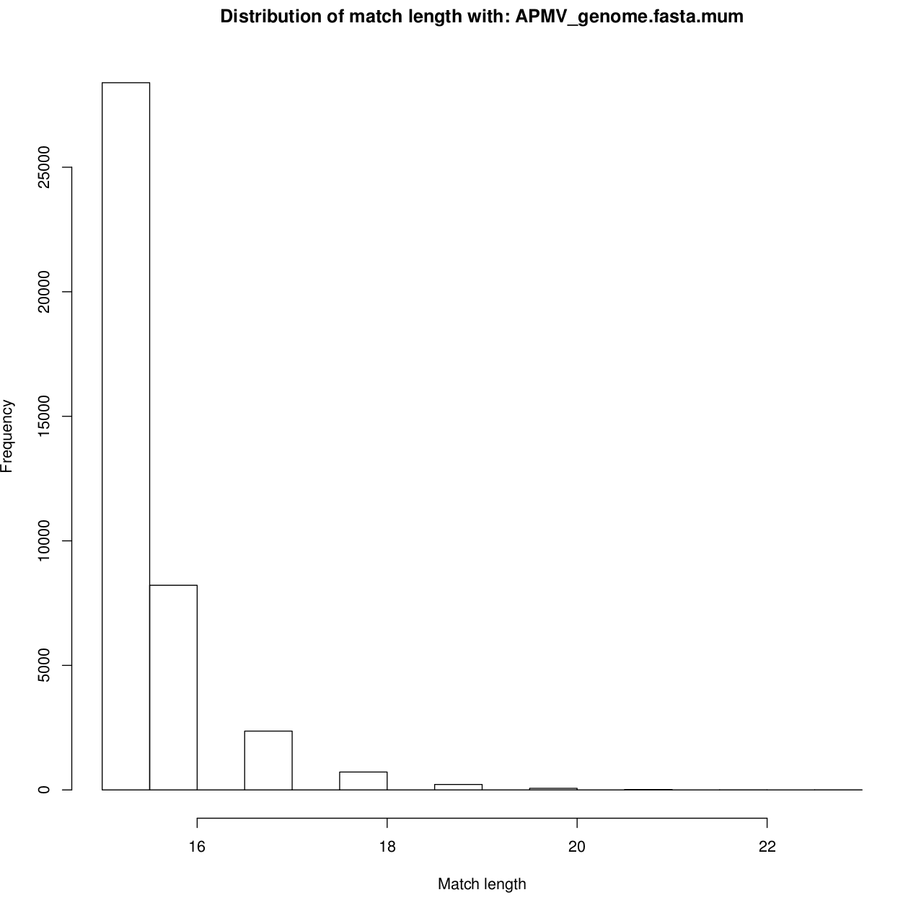

Dotplots were created with Mummer (Maximal Unique matches) to see potential clusters of matches between two genomes

Mummer was run with the Legionella genome as reference and the other genomes as query sequences. The script mummer\_create_mums.sh compares all genomes against Legionella. Mummer call:

mummer -mum

-b both forward and rev strand

-c report all matches relative to forward strand

-L Show length of query sequence on header line

And since the plotting function of mummer is broken, mummer\_plotter.sh calls an R script to generate the dotplots and distribution of match sizes.

Additionally, the mgaps option was used to cluster together mums with a possible gap between them (bottom plots). Still does not show any striking clusters, only with very relaxed parameters were matches are kbs apart. Also the documentation is not very clear. Example call of mgaps:
 
mgaps 

-d 2000 Maximum fixed diagonal difference 

-l 20 Minimum cluster length

-f 0.9 Maximum fraction of separation for diagonal difference (?)

-s 1000 Maximum separation between adjacent matches in a cluster

