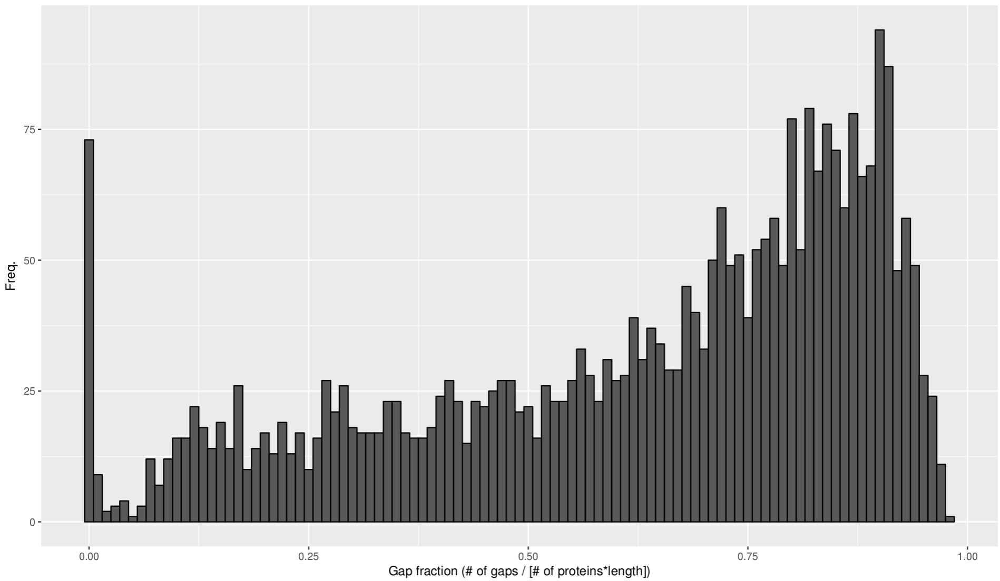
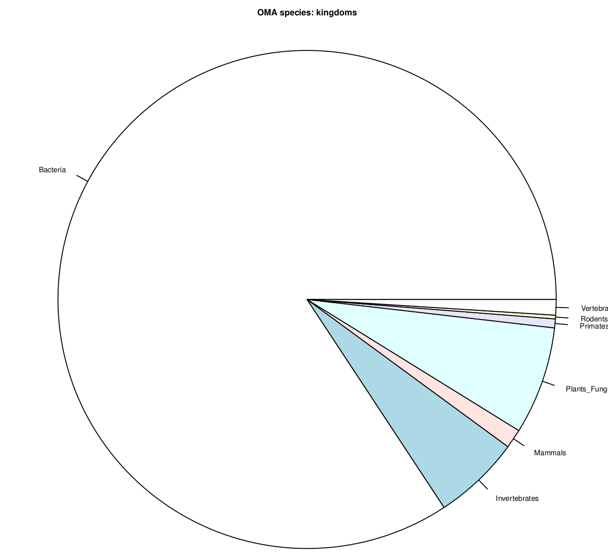
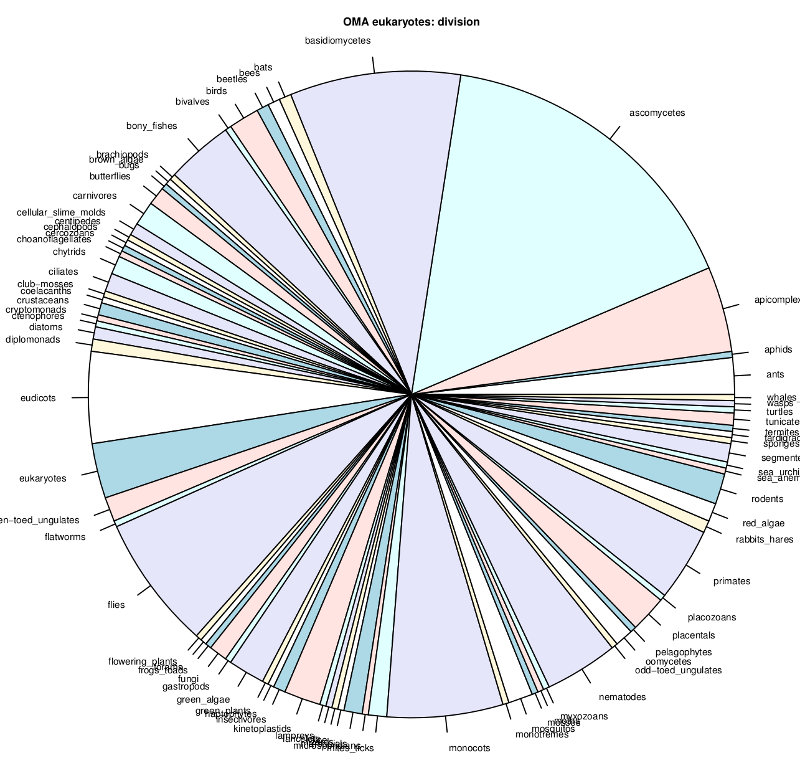
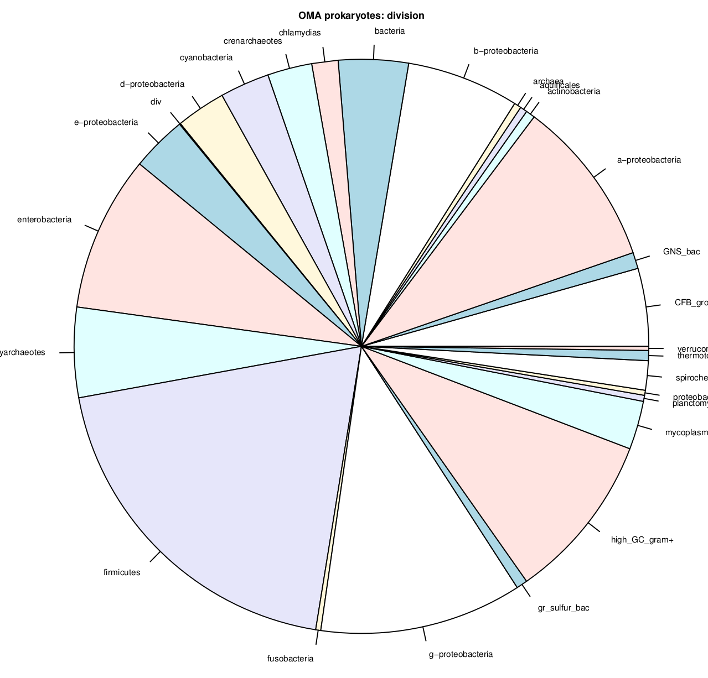

With the entire published OMA database an analysis pipeline was built, which would later be used on a more specific set of species. Since APMV and the Amoeba polyphaga are not part of the OMA database, they had to be added separately with OMA standalone.

## OMA database

OMA groups were downloaded from: http://omabrowser.org/oma/current/ and saved in HGT/data\_oma.  

only groups that contain a protein of Legionella (OMA ID: LEGPC) are interesting in this case.

```{bash}
cat oma-groups.txt | grep "LEGPC" > oma_groups_LEGPC
```

3070 genes from Legionella are uniquely assigned in these groups, 134 genes are not part of an orthologous group.

The sequences of the proteins in each group were then concatenated for alignment.

## Alignment with muscle

the script create\_muscle_jobs.sh generates a list of jobs to get submitted to the cluster.

muscle 

-in groupfile 

-fastaout groupfile.fasta.afa 

-phyiout groupfile.phylip.afa

To produce both fasta-alignments for inspection in Jalview as well as phylip-alignments that can be used by protdist


Alignments were afterwards evaluated with the script eval\_alignments.sh, which calculates the dimension of the alignment (number of species * length) and the number of gaps in the alignment. It then calls an R script to get the fraction of gaps and plot a histogram for all OMA groups.



## Protdist to get distances

Distances between the proteins in the orthologous groups were calculated with protdist. The weird interactive menu of the program can be circumvented by supplying a paramter file via standard input for every run. The script protdist\_cluster\_prep.sh generates a parameter file and a bash-jobfile for every alignment that get submitted to the cluster. The submission works via the script protdist\_cluster\_sub.sh that is also created in the process.

An example parameter file looks like this:

```{bash}
../phylip/groupfile.seq.phylip.afa
F
groupfile.protdist
P
P
2
Y
```

with the first line specifying the input file (if no file called infile is found in the working directory), F toggles the renaming of the output to the third line (only if a file called outfile is present in the working directory, script takes care of that). P,P switches to the Dayhoff PAM-Matrix (suggested by Annalisa because of Vingron-paper). 2 to turn off verbosity. Y to confirm and start the run.


Afterwards, the script protdist\_cluster\_post.sh extracts only the distances from the Legionella protein in each group to all others in the same group and puts them in a list


## Other downstream analysis

With the script generate\_distance\_list\_per\_taxon.sh, the distances of all orthologs between that species and legionella are written to a new file.

these files are used by summary\_per\_taxon.sh to create a summary of distances for all taxa.

collect\_taxon\_info.sh uses a list of all invloved species and downloads information on the kingdom and division via the Edirect utilities. This information was used in plotting the results.


## Species info








