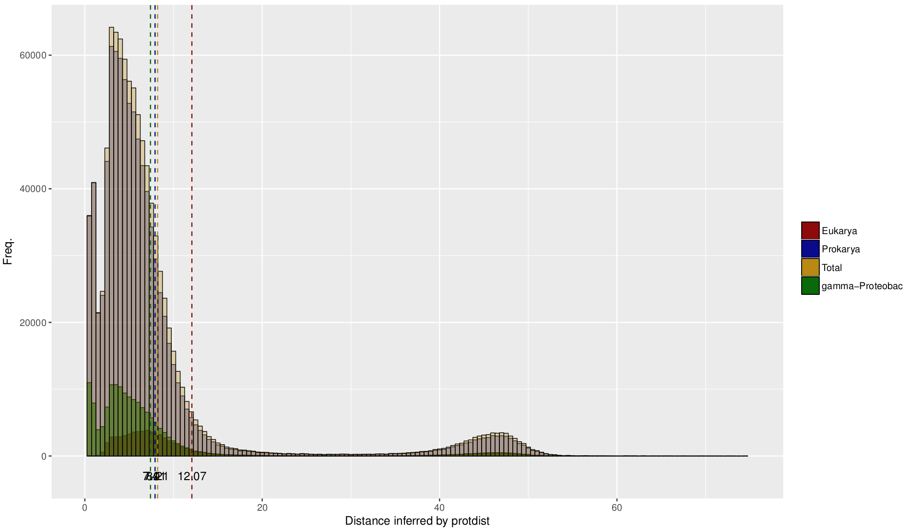
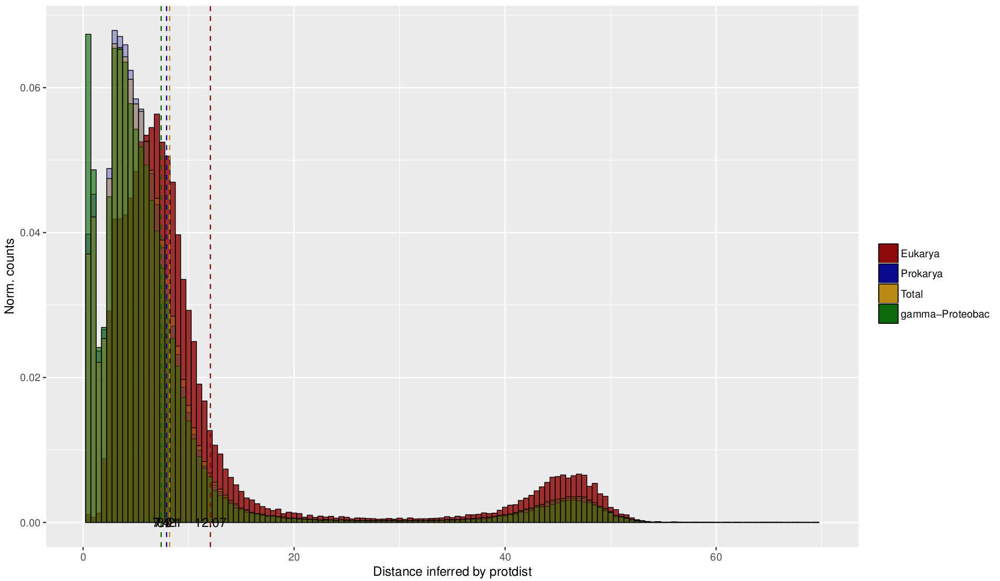

## Distribution of distances

The first two plots show the distribution of distances for all orthologs between Legionella and other members of a kingdom/division that are in the OMA database. The second one is normalized by the number of orthologs. Vertical lines show the means of the distribution.

## Number of orthologs/mean distance per species

On these figures all species from the full OMA database are plotted by the number of orthologs they share with Legionella corby or by the mean distance of their orthologs to Legionella corby. The order on the x-axis is also given in the title. DIfferences in the position of a certain species between the plots might hint to interesting irregularities. 

These plots are interactive, meaning you can draw a box and double click to zoom/reset the zoom. The table on the bottom is searchable by any column.

