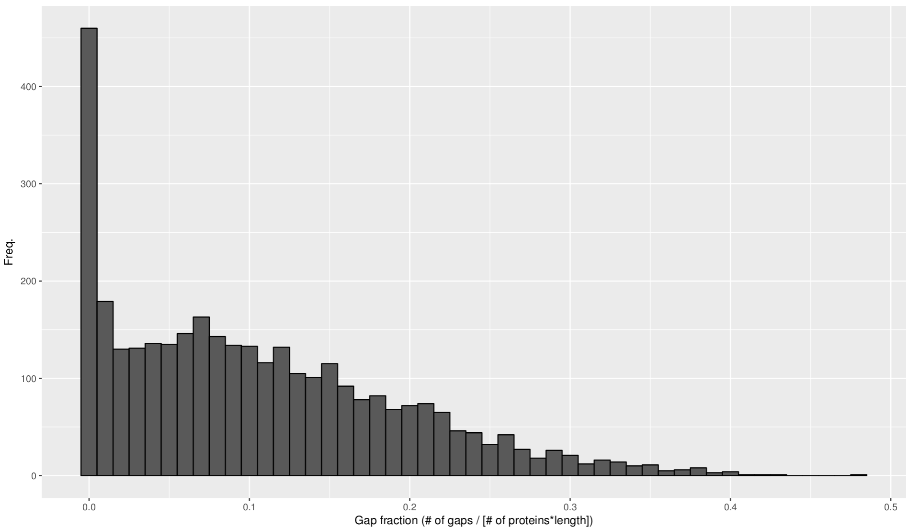
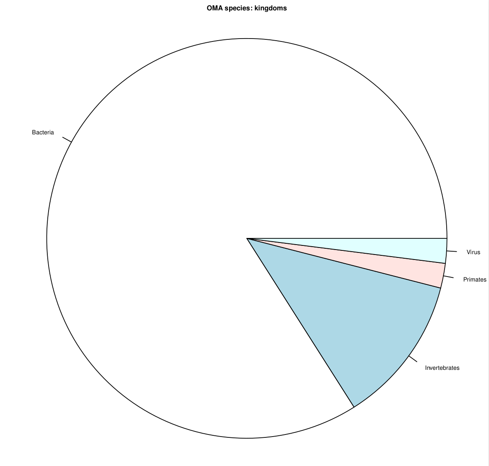
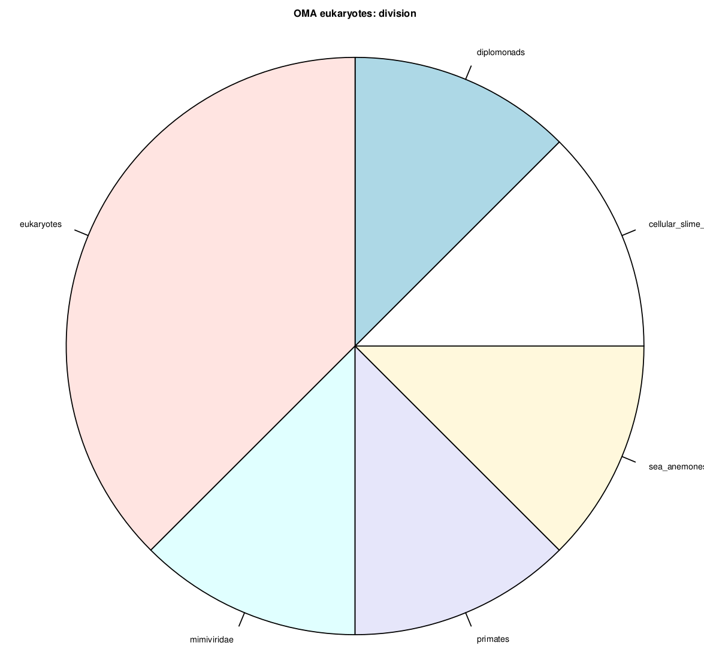
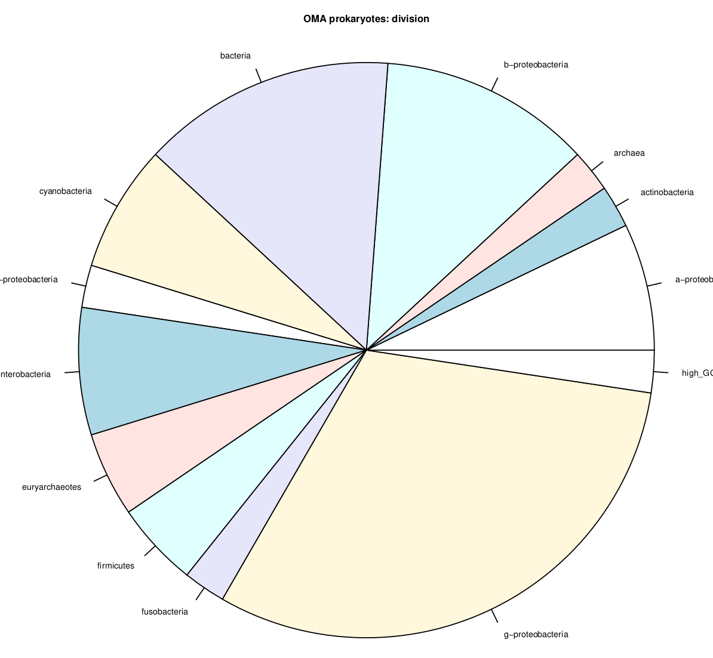

In this dataset, 48 species from the OMA database were combined with the Mimivirus and Amoeba proteome to find the orthologs between these species and Legionella.

To include the mimivirus and the amoeba into our analysis we have to compute the all:all distances for these two species against all others. Since the OMA database only allows to download 50 species at a time and the computational effort increases with every species added, we decided on a set of 50 species that seemed resonable and interesting.

## Downstream processing

The precalculated all:all comparisons of the 48 species already in the database can be downloaded and come with a separate distribution of OMA, and also with the specific directories it needs to operate. The species to be added can be placed in the DB/ directory within the downloaded precalculated OMA distribution. Then the program is run be simply calling oma from the parent dir.

This time 3061 proteins of Legionella were uniquely assigned, 143 unassigned. 9 Proteins less than in the dataset with all species.

11 proteins of Legionella and Mimivirus were put together into OMA groups, additionally 10 more 1:1 orthologs, not assigned to a group, were found.

If an oma run crashes with a strange error message, setting FunctionPrediction=FALSE in the parameters file can fix it. It will pick up where it crashed as well.

## Manually adding 1:1 orthologs

Once finished, OMA does not only provide the orthologous groups but also a list of 1:1 orthologs between species that were not added to specific groups. These 1:1 orthos between Legionella and Mimivirus as well as between Legionella and Acanthamoeba were added manually as groups of only 2 proteins.

This results in 3061 regular OMA groups containing a Legionella protein; and 267 groups of legionella-amoeba 1:1 orthos; and 11 legionella-mimivirus 1:1 orthos. They can be found in /project/ngs_marsico/HGT/26b_muscle/groups/

## Alignment and distance calculation

Muscle and protdist were run as previously on the set of all species in the OMA database. The fraction of gaps in the alignments seems much smaller this time, which makes sense with many fewer species.

The table on the bottom gives information on the 50 species used for OMA standalone

## Species info

