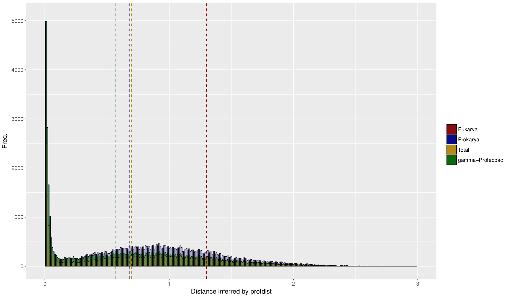

## Distribution of distances

The first two plots show the distribution of distances for all orthologs between Legionella and other members of a kingdom/division were used in the OMA standalone. The second one is normalized by the number of orthologs. Vertical lines show the means of the distribution. The bump at a distance of around 60, which is visible on the plot of the full dataset does not show up here. The maximum distance of this dataset is ~4.

## Number of orthologs/mean distance per species

On the next figures all 50 species from the OMA standalone run are plotted by the number of orthologs they share with Legionella corby or by the percentage of their protein being orthologous or by the mean distance of their orthologs to Legionella corby. The order on the x-axis is given in the title of each plot. DIfferences in the position of a certain species between the plots might hint to interesting irregularities. 

