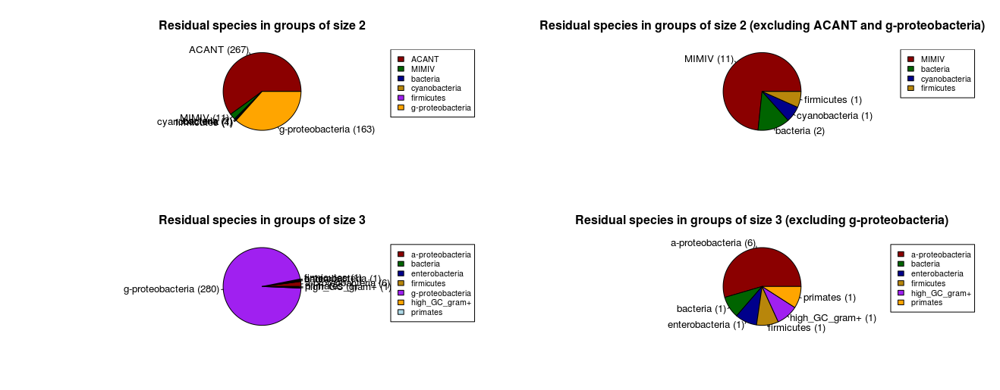

OMA groups with 2 or 3 species could not be used for building trees, however these groups could be specially informative for HGT. The pie charts below show the species, besides Legionella that are part of these groups. 

The groups with two species consisting of Acanthamoeba/Mimivirus + Legionella were added manually according to ortholgy that OMA found but could not map to a group.

The pies on the right are zoomed versions of the convoluted parts in the left plots.

